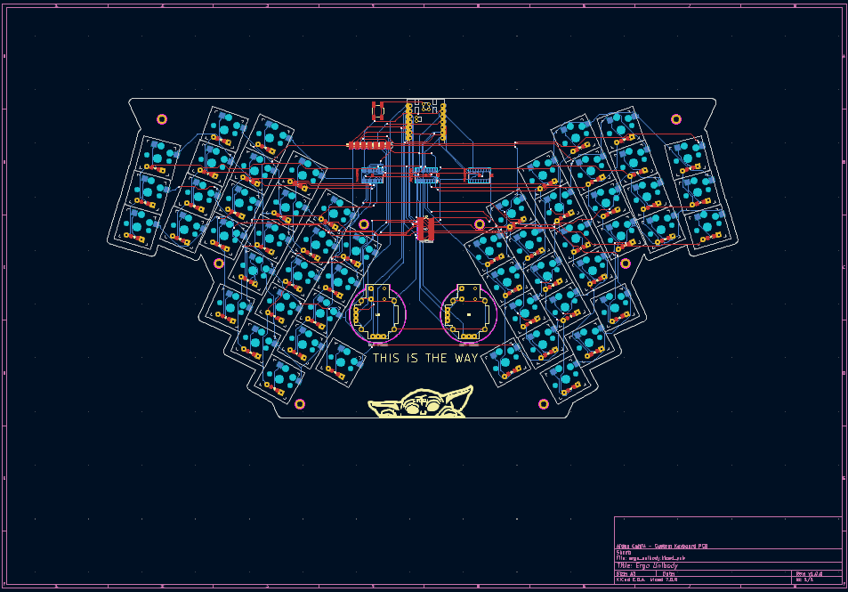
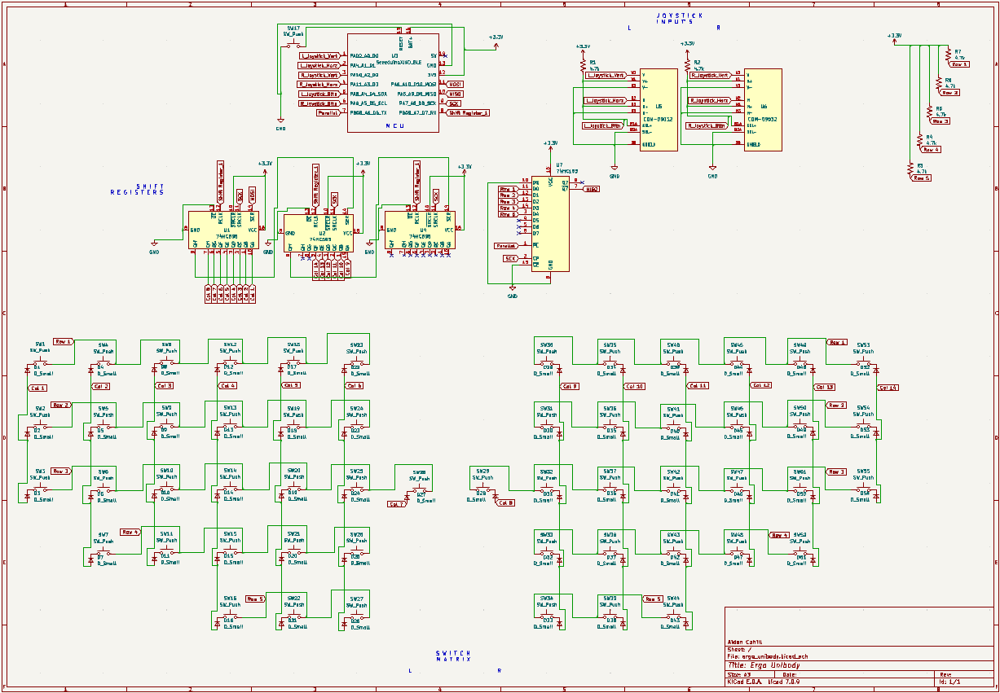

# custom-keyboard

A 54-key split ergonomic keyboard with analog joysticks, shift register matrix scanning, and a Seeeduino XIAO nRF52840 BLE microcontroller. Designed from scratch using Ergogen, KiCad, and ZMK firmware.





## Features

- 54 Kailh Choc V1 low-profile keys with hotswap sockets
- Split ergonomic layout with column stagger and splay
- 2× analog joysticks (mouse movement + scroll)
- 74HC595 shift registers for column scanning (3× SIPO)
- 74HC165 shift register for row reading (1× PISO)
- Seeeduino XIAO nRF52840 BLE MCU
- 3D printed case with integrated bottom plate and heat-set inserts
- Custom Grogu silkscreen art

## Layout

```
Left half:                              Right half:
+---+---+---+---+---+---+              +---+---+---+---+---+---+
|Esc| 1 | 2 | 3 | 4 | 5 |              | 6 | 7 | 8 | 9 | 0 |Bks|
+---+---+---+---+---+---+              +---+---+---+---+---+---+
|Tab| Q | W | E | R | T |              | Y | U | I | O | P | \ |
+---+---+---+---+---+---+---+      +---+---+---+---+---+---+---+
| ` | A | S | D | F | G |Spc|      |Ent| H | J | K | L | ; | ' |
+---+---+---+---+---+---+---+      +---+---+---+---+---+---+---+
    | Z | X | C | V | B |              | N | M | , | . | / |
    +---+---+---+---+---+              +---+---+---+---+---+
            |Ctl|Shf|Alt|              |Fn |Shf|Alt|
            +---+---+---+              +---+---+---+

Fn Layer:
+---+---+---+---+---+---+              +---+---+---+---+---+---+
|F1 |F2 |F3 |F4 |F5 |F6 |              |F7 |F8 |F9 |F10|F11|F12|
+---+---+---+---+---+---+              +---+---+---+---+---+---+
| ~ | ! | @ | # | $ | % |              | ^ | & | * | ( | ) |Del|
+---+---+---+---+---+---+---+      +---+---+---+---+---+---+---+
|   | - | = | [ | ] | \ |   |      |   | ↓ | ← | ↑ | → |   |   |
+---+---+---+---+---+---+---+      +---+---+---+---+---+---+---+
    | _ | + | { | } | | |              |Hom|PgD|PgU|End|   |
    +---+---+---+---+---+              +---+---+---+---+---+
```

## Joystick Controls

| Joystick | Axis | Function |
|----------|------|----------|
| Right | Move | Mouse cursor |
| Right | Click | Left click |
| Left | Move | Scroll |
| Left | Click | Right click |

## Repository Structure

```
custom-keyboard/
├── pcb/                  KiCad schematic, PCB, and gerbers
├── case/
│   └── stl/              Print-ready STL file
├── ergogen/              Original Ergogen layout config
├── firmware/             Link to ZMK firmware repo
└── docs/                 Build guide, BOM, and photos
```

## Quick Start

1. **Order PCBs** — upload `pcb/gerbers/` to JLCPCB or PCBWay (2-layer, 1.6mm, any color)
2. **Order components** — see [BOM](docs/bom.md)
3. **3D print case** — slice `case/stl/case_3mm_bottom.stl` (PETG, 50% infill)
4. **Solder** — follow the [build guide](docs/build_guide.md)
5. **Flash firmware** — see [firmware/README.md](firmware/README.md)

## Pin Mapping

| XIAO Pin | Function |
|----------|----------|
| D0 (A0) | Left Joystick Vertical (ADC) |
| D1 (A1) | Left Joystick Horizontal (ADC) |
| D2 (A2) | Right Joystick Vertical (ADC) |
| D3 (A3) | Right Joystick Horizontal (ADC) |
| D4 | Left Joystick Button |
| D5 | Right Joystick Button |
| D6 | 74HC165 PL (parallel load) |
| D7 | 74HC595 RCLK (latch) |
| D8 | SCK (shared SPI clock) |
| D9 | MISO (74HC165 serial data) |
| D10 | MOSI (74HC595 serial data) |

## Matrix Architecture

The keyboard uses a 14-column × 5-row matrix:

- **Columns** are driven by 3× daisy-chained 74HC595 shift registers (serial-in, parallel-out) via SPI MOSI
- **Rows** are read by 1× 74HC165 shift register (parallel-in, serial-out) via SPI MISO
- **Diodes** (1N4148W SOD-123) prevent ghosting, oriented column-to-row
- All shift registers share the SPI clock (SCK), with separate CS/latch pins

## Firmware

ZMK firmware lives in a separate repo: **[custom-keyboard ZMK firmware](https://github.com/aidancahill/custom-keyboard-zmk-firmware)**

Custom ZMK modules include:

- `zmk,gpio-165` — 74HC165 PISO shift register GPIO input driver
- `zmk,input-analog-joystick` — analog joystick pointing device driver

## Design Tools

- **Layout**: [Ergogen](https://ergogen.xyz)
- **PCB**: [KiCad 7](https://www.kicad.org)
- **Routing**: [FreeRouting](https://freerouting.org)
- **Case**: [OpenJSCAD](https://openjscad.xyz)
- **Firmware**: [ZMK](https://zmk.dev)

## Resources & Acknowledgments

| Resource | Description |
|----------|-------------|
| [Ergogen Web UI](https://ergogen.cache.works/) | Browser-based Ergogen layout editor |
| [Ergogen](https://github.com/ergogen/ergogen) | Ergonomic keyboard generator framework |
| [Cantor Keyboard](https://github.com/diepala/cantor) | Split keyboard reference design |
| [Triboard](https://github.com/tarneaux/triboard) | Split keyboard reference design |
| [Kiai Split](https://github.com/makgyber/kiai-split) | Split keyboard reference design |
| [Awesome Split Keyboards](https://github.com/diimdeep/awesome-split-keyboards) | Curated list of split keyboard projects |
| [TOTEM Keyboard](https://github.com/GEIGEIGEIST/TOTEM) | Split keyboard with XIAO BLE support |
| [FlatFootFox](https://flatfootfox.com/) | Ergogen and keyboard design tutorials |
| [Getting Started with Keyboard PCBs](https://brianlow.notion.site/Getting-Started-5c18955a43044c5f98100212e83c19ef) | PCB design guide for keyboards |
| [The Keyboard Matrix](https://www.dairequinlan.com/2020/12/the-keyboard-part-2-the-matrix/) | How keyboard matrices work |
| [74HC595 Shift Register Tutorial](https://lastminuteengineers.com/74hc595-shift-register-arduino-tutorial) | 74HC595 wiring and code tutorial |
| [74HC595 Keyboard Build](https://mehmedbasic.dk/post/74hc595-keyboard/) | Using shift registers in keyboards |
| [Keyboard Layout Editor](https://www.keyboard-layout-editor.com/#/) | Visual keyboard layout designer |

## License

MIT
